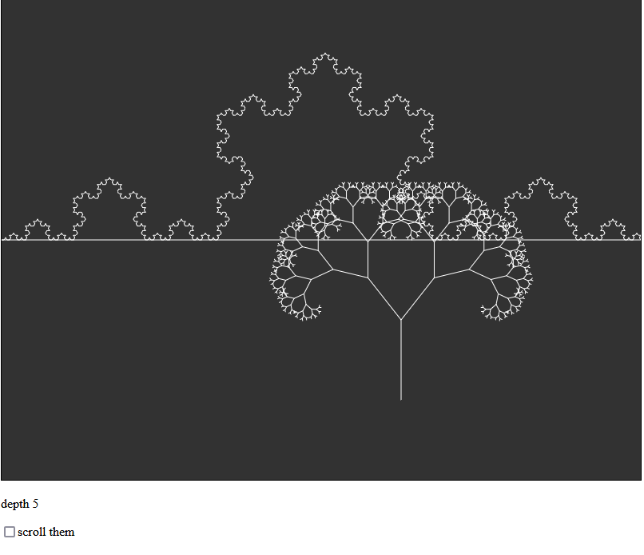

# Koch landscape and fractal tree

Here I am revisiting creating fractals with recursion. 

Dan Shiffman’s Nature of Code was the original inspiration for 

the fractal tree with recursion.  

Also I have just finished David Feldman's courses on Fractals 

and Chaos. And went a bit deeper into the math of the fractal dimension

https://www.complexityexplorer.org/courses/118-fractals-and-scaling

I had previously only created the Koch curve using L-systems

here I am just using translate() rotate() and lines()

The code for the Koch curve is all my own.  

I am sure it could be optimized.  

I have a function called rule that draws level 1 of Koch with lines.

Then I have a recursive function called Koch that makes recursive calls to that rule.

see it live here:

https://greggelong.github.io/kochTreejs

the mouse changes the level of the curve and the angle of the tree

If the check box is checked the tree and curve scroll
